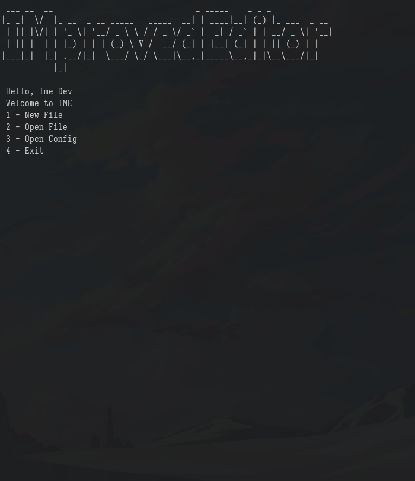

# IMproved-Editor
IMproved-Editor or IME is a open-source ncurses terminal based text editor written in
python, the main goals are:
 - Python configuration with a custom wrapper
 - Minimalistic and lightweight editor
 - Modal editor with vim-based (hjkl) movement keys

## Documentation
IME is a modal editor, it has 2 modes, `CNTRL`, to do advanced operations and
`INSRT` to insert new text into the file, to swap mode you press `^D`, for
example if you are in `INSRT` mode and you press `^D` now you are in `CNTRL`
mode, by default there isn't any keybindings, but you can enable some default
keybindings, see [CONFIG.md](https://github.com/darhsn/improved-editor/blob/master/CONFIG.md) for more
## Screenshots
**TODO**: Add screenshots

